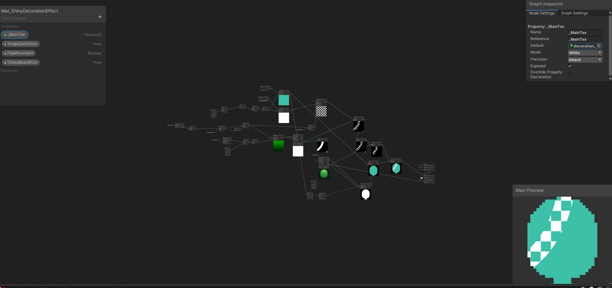
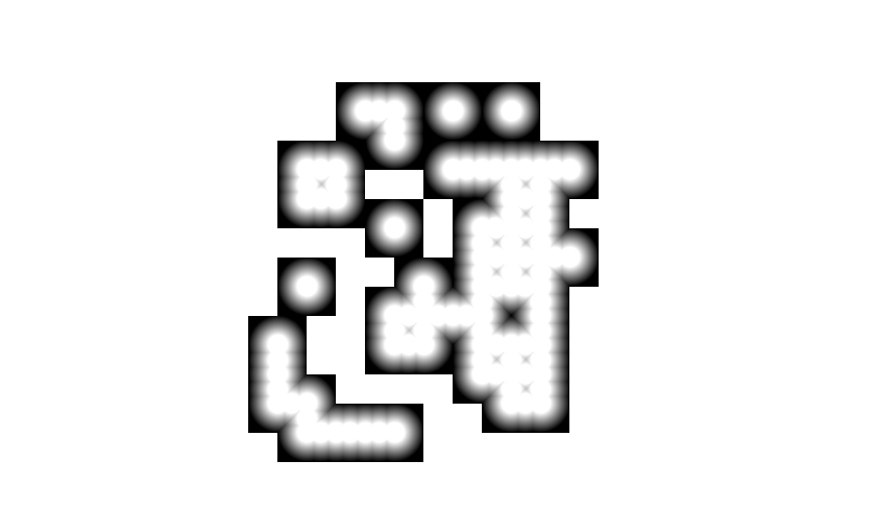
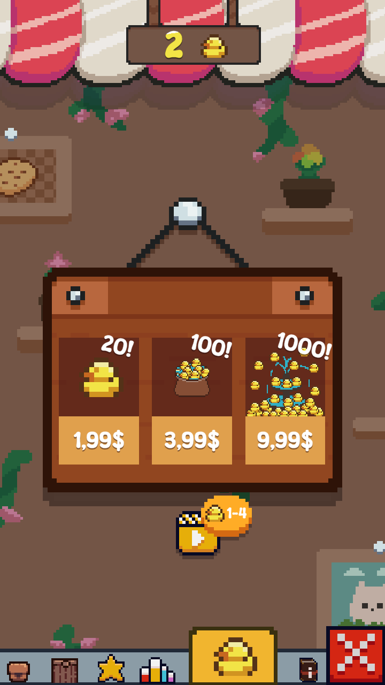

  <!-- MAIN HEAD -->
  <h1>  Resourceful (release 2024): </h1>
  <h4> Builder-god/clicker hybrid made in Unity game engine and c# programming language  </h4>
  <!-- Content -->
  <table>
    <!--==================Row 1=====================-->
    <tbody align="center">
      <tr>
        <!-- column 1 -->
        <th width="350px"> </th>
        <!-- column 2 -->
        <td width="650px">
          <h4>👑Packages used:</h4>
          👉-URP 
          👉Shader graph 
          👉Tilemaps 
          👉Cinemachine 
          👉Advertisement Legacy 
          👉Input System 
          👉Astar pathfinding 
          👉uiextenstions 
          👉DOTween 
          👉OdinSerializer 
          👉TextMeshPro 
          👉play-games-plugin-for-unity 
          👉UnityColorPicker 
          👉InAppPurchasing 
          👉Unity Recorder 
        </td>
      </tr>
    </tbody>
     <!--==================Row 2=====================-->
  <tbody  align="center">
    <td>
      
    </td>
    <td>
       <h3>Shaders: </h3>
        -shiny decoration VFX that is scalable with any texture sprites
    </td>
  </tbody>
     <!--==================Row 3=====================-->
  <tbody  align="center">
    <td>
      
      <video src='ReadmeResources/texturesInAction.mp4' width=180/>
    </td>
    <td>
       <h3>ComputeShaders: </h3>
        👉Used to procedularry recreate water texture, it take snapshot of tilemap's each placed tile and converting it to this texture to minimalize drop performance when creating new lands, that next is processed by shader graph to add water animations and colors 
        👉Used to procedularry recreate land contact points with water,and creating several jpg's keyframes to play texture in loop in real time  
    </td>
  </tbody>
    <!-- ==================Row 4=====================-->
  <tbody align="center">
    <td>
        <h3>🧰</h3>
    </td>
    <td>
      <h3>Also including several editor helpfull tools like: </h3>
    </td>
  </tbody>
    <!-- ==================Row 5=====================-->
  <tbody align="center">
    <td>
        
    </td>
    <td>
      <h4>👑Achivement editor, made using unity EditorWindow: </h4>
      in this editor you can create custom achivement with one of 4 rewards types (SpecificResource,SpecificUpgrade,Lootbox,UpgradeStat) and with done conditions that are automaticlly expendent based on stored game        statistics 
      Editor is scalable and newbie friendly because of easy editor with achivement filtering of which ones to show 
    </td>
  </tbody>
     <!-- ==================Row 6=====================-->
  <tbody  align="center">
    <td>
      
    </td>
    <td>
      👉easy inspector property assignment using unity resources and CustomPropertyDrawer: 
    </td>
  </tbody>
    <!-- ==================Row 7=====================-->
  <tbody  align="center">
    <td>
      
    </td>
    <td>
      👉Accesorie editor
    </td>
  </tbody>
     <!-- ==================Row 8=====================-->
  <tbody  align="center">
    <td>
      <h3>🧰</h3>
    </td>
    <td>
      <h3>Game has systems like: </h3>
    </td>
  </tbody>
     <!-- ==================Row 9=====================-->
  <tbody  align="center">
    <td>
      
    </td>
    <td>
      👉temporarry powerUps 
      👉smooth music transition 
      👉upgrade statistics system 
      👉Building system 
    </td>
  </tbody>
    <!-- ==================Row 10=====================-->
  <tbody  align="center">
    <td>
      
    </td>
    <td>
      👉Inventory system 
      👉LootBoxes 
      👉Expend lands with runtime astar pathfinding obstacle update   
    </td>
  </tbody>
    <!-- ==================Row 11=====================-->
  <tbody  align="center">
    <td>
      
    </td>
    <td>
      👉Premium currency (using InAppPurchasing and Advertisement Legacy) 
    </td>
  </tbody>
     <!-- ==================Row 12=====================-->
  <tbody  align="center">
    <td>
      
    </td>
    <td>
      👉runtime support for hundreds of achivements and stats 
      👉any amount of floating and movable ui windows that saves own location through game sessions 
    </td>
  </tbody>
    <!-- ==================Row 13=====================-->
  <tbody  align="center">
    <td>
      
    </td>
    <td>
      👉energy integration with buildings 
      👉skill tree 
    </td>
  </tbody>
   
  </table>

<!-- https://drive.google.com/file/d/1d7G4AXNuLOmn756SuX1ct3lqAVseKSPz/view?usp=sharing -->
<h3> source code showoff via Adding to collaborators </h3>
