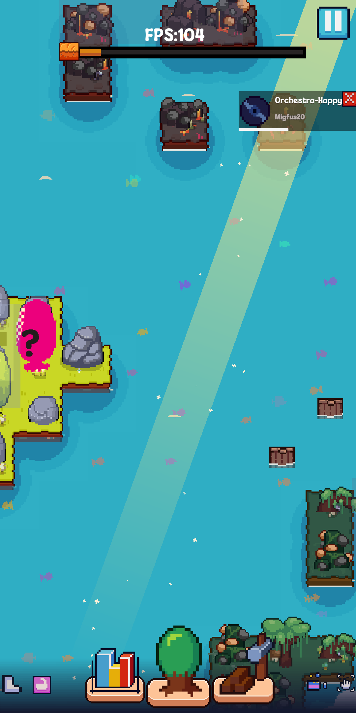
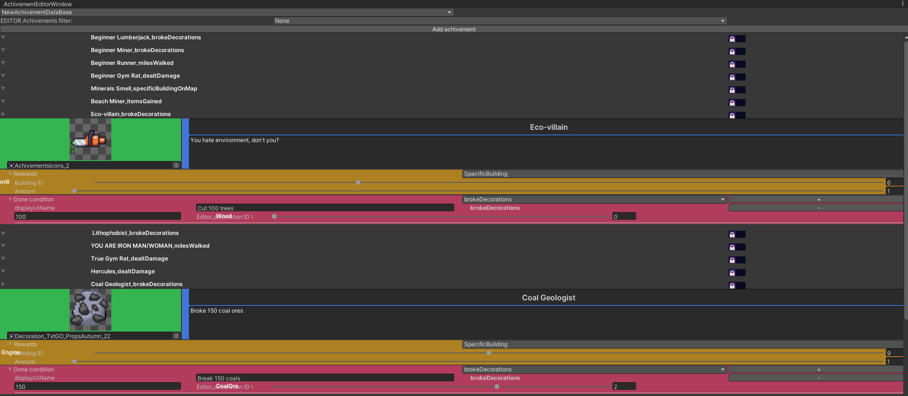
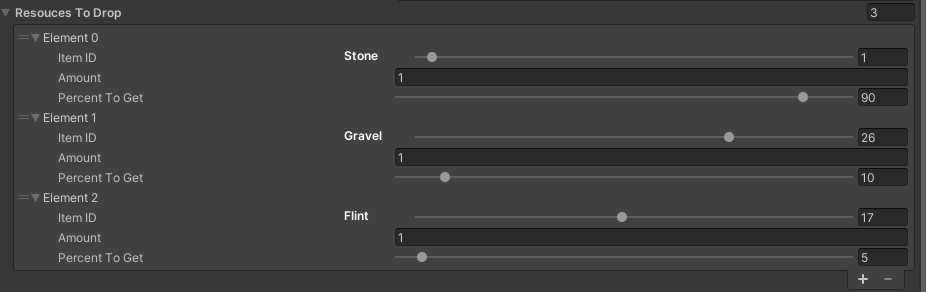
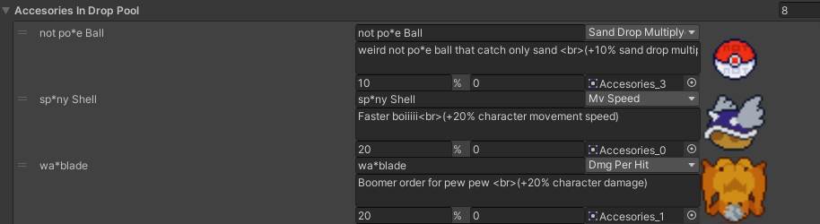
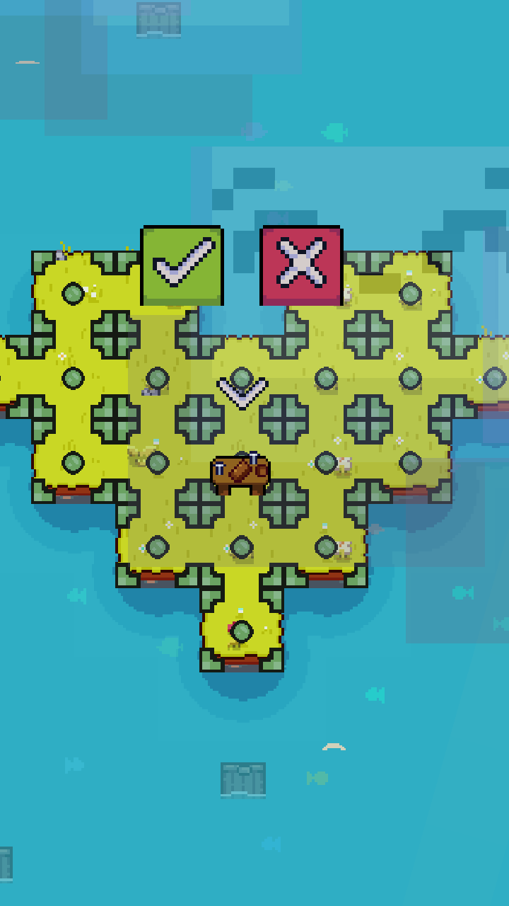
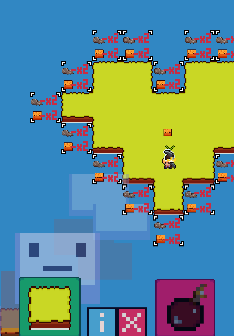
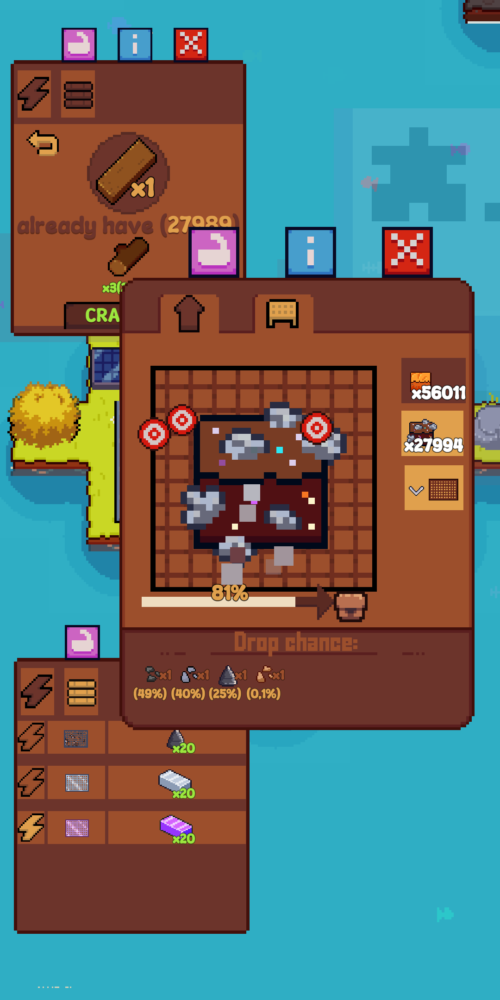
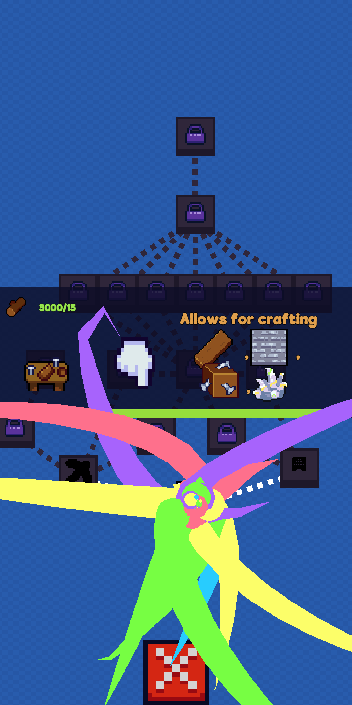

<h1>Game mobile project (release date 2024): </h1>

 
<h3>This game is builder-god clicker hybrid made using Unity game engine and c# programming language 
in project you can find packages like: </h3>

-cinemachine 
-Advertisement 
-Input System 
-URP 
-Astar pathfinding 
-uiextenstions 
-DOTween 
-OdinSerializer 
-TextMeshPro 
<h3>Also including several editor helpfull tools like: </h3>

-Achivement editor, made using unity EditorWindow: 
in this editor you can create custom achivement with one of 4 rewards types (SpecificResource,SpecificUpgrade,Lootbox,UpgradeStat) and with done conditions that are automaticlly expendent based on stored game statistics 
Editor is scalable and newbie friendly because of easy editor with achivement filtering of which ones to show 
 
-easy inspector property assignment using unity resources and CustomPropertyDrawer: 
 
-Accesorie editor
 

<h3>Game has systems like: </h3>

-temporarry powerUps 
-smooth music player 
-upgrade statistics system 
-Building system 
 
-Inventory system 
-LootBoxes (with ad reward) 
-Expend lands with runtime astar pathfinding obstacle update   
 
-runtime support for hundreds of achivements and stats 
-any amount of floating and movable ui windows that saves own location through game sessions 
 
-energy integration with buildings 
-skill tree 
 
[Google drive link to game beta](https://drive.google.com/file/d/1d7G4AXNuLOmn756SuX1ct3lqAVseKSPz/view?usp=sharing) 
<h3> source code showoff via my individual permission and adding to collaborators </h3>
